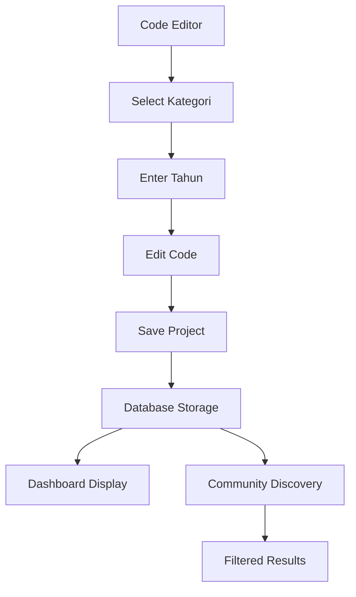

# Project Categorization Feature - Product Requirements Document

## 1. Product Overview

Enhancement to the Interactive Link website builder platform to add educational project categorization capabilities. This feature allows users to organize their projects by subject category and academic year for improved project management and discovery.

- **Purpose**: Enable users to categorize educational projects by subject and year for better organization, filtering, and community discovery
- **Target Users**: Educators, students, and content creators building educational websites and projects
- **Business Value**: Improved user experience through better project organization and enhanced community features for educational content discovery

## 2. Core Features

### 2.1 User Roles
No additional user roles required - this feature extends existing functionality for all authenticated users.

### 2.2 Feature Module

Our project categorization enhancement consists of the following main components:
1. **Code Editor Enhancement**: Updated editor interface with category and year fields beside preview area
2. **Database Schema Update**: Extended projects table to store categorization data
3. **Project Management**: Enhanced project creation and editing workflows
4. **Community Discovery**: Improved filtering and search capabilities in project community

### 2.3 Page Details

| Page Name | Module Name | Feature Description |
|-----------|-------------|---------------------|
| Code Editor | Category Selection | Add dropdown field with 6 subject options: Matematik, Sejarah, Sains, Bahasa Melayu, Bahasa Inggeris, Pendidikan Islam |
| Code Editor | Year Input | Add text input field for academic year (e.g., 2024, 2025) |
| Code Editor | Save Integration | Automatically save category and year data when project is saved |
| Dashboard | Project Display | Show category and year information in project cards and lists |
| Project Community | Enhanced Filtering | Filter projects by category and year for better discovery |
| Project Community | Category Display | Display project category and year in community project listings |

## 3. Core Process

### Main User Operation Flow:

**Project Creation/Editing Flow:**
1. User navigates to Code Editor page
2. User sees existing code editor with preview panel
3. User notices new "Kategori" dropdown and "Tahun" input field positioned beside preview area
4. User selects appropriate subject category from dropdown
5. User enters academic year in text field
6. User continues editing project code as normal
7. When user clicks "Save & Version" button, category and year are automatically saved with project
8. System stores all data (code, category, year) in database

**Project Discovery Flow:**
1. User visits Project Community page
2. User can filter projects by category using new filter options
3. User can search or filter by year
4. Project cards display category and year information
5. User can discover relevant educational content more easily



## 4. User Interface Design

### 4.1 Design Style
- **Primary Colors**: Maintain existing blue (#3B82F6) and dark theme consistency
- **Secondary Colors**: Use subtle gray (#6B7280) for form labels
- **Form Elements**: Rounded corners (8px), consistent with existing button styles
- **Typography**: Use existing font stack (Inter/system fonts), 14px for form labels, 16px for inputs
- **Layout**: Clean, minimal design that integrates seamlessly with current editor layout
- **Icons**: Use existing icon style (Lucide icons) for dropdown arrows and form indicators

### 4.2 Page Design Overview

| Page Name | Module Name | UI Elements |
|-----------|-------------|-------------|
| Code Editor | Category Dropdown | Positioned above preview area, full-width select element with blue border on focus, dropdown arrow icon, placeholder text "Pilih Kategori" |
| Code Editor | Year Input | Positioned below category dropdown, numeric input field with placeholder "Contoh: 2024", same styling as category field |
| Code Editor | Form Container | White background card with subtle shadow, 16px padding, 8px border radius, positioned in right sidebar above preview |
| Dashboard | Project Cards | Small category badge with colored background, year displayed as secondary text |
| Community | Filter Panel | Category filter chips, year range selector, integrated with existing search functionality |

### 4.3 Responsiveness
- **Desktop-first design** with mobile-adaptive layout
- **Mobile**: Category and year fields stack vertically, maintain touch-friendly 44px minimum height
- **Tablet**: Fields remain side-by-side with adjusted spacing
- **Touch optimization**: Larger dropdown targets and input areas for mobile devices

## 5. Technical Requirements

### 5.1 Database Schema Changes
```sql
-- Add category and year fields to projects table
ALTER TABLE projects 
ADD COLUMN kategori VARCHAR(50),
ADD COLUMN tahun INTEGER;

-- Create index for better query performance
CREATE INDEX idx_projects_kategori ON projects(kategori);
CREATE INDEX idx_projects_tahun ON projects(tahun);
```

### 5.2 API Updates
- Update project creation/update endpoints to accept `kategori` and `tahun` parameters
- Modify project retrieval endpoints to include category and year data
- Add filtering capabilities to community project queries

### 5.3 Frontend Components
- New `CategorySelector` component for dropdown functionality
- New `YearInput` component for year entry
- Updated `ProjectCard` component to display category and year
- Enhanced `CommunityFilters` component for filtering by category/year

### 5.4 Data Validation
- Category must be one of the 6 predefined options
- Year must be a valid 4-digit number (1900-2100 range)
- Both fields are optional but recommended for better organization

## 6. Success Metrics

### 6.1 User Engagement
- **Target**: 80% of new projects include category selection within 30 days
- **Target**: 60% of projects include year information
- **Measure**: Category/year field completion rates

### 6.2 Community Discovery
- **Target**: 40% increase in project views through category filtering
- **Target**: Improved search relevance scores for educational content
- **Measure**: Community page engagement and filter usage analytics

### 6.3 User Satisfaction
- **Target**: Maintain current user satisfaction scores while improving organization features
- **Measure**: User feedback surveys and feature adoption rates