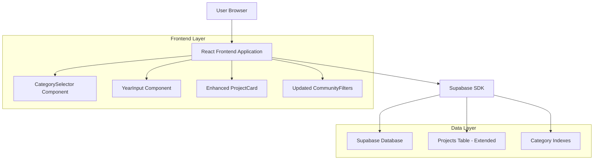
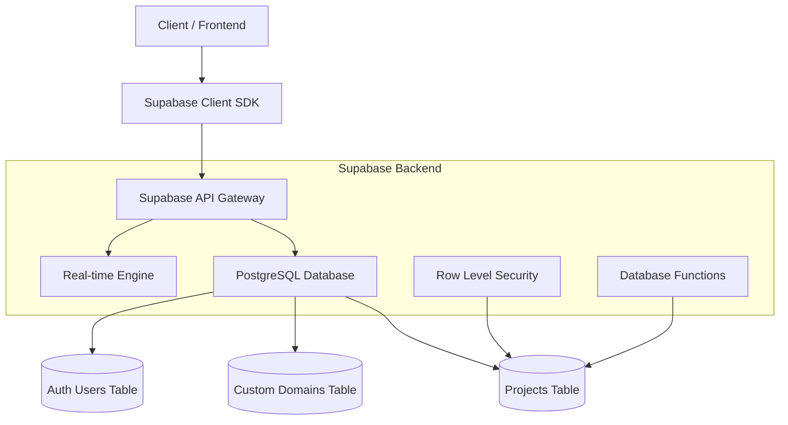
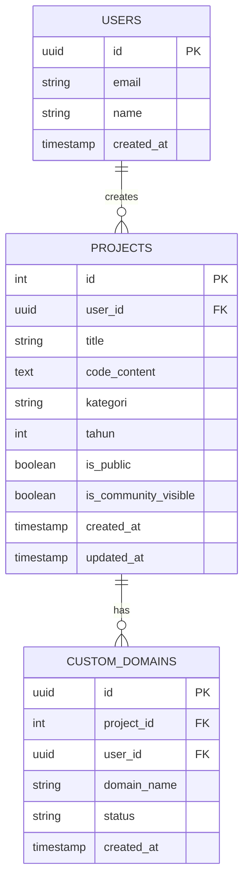

# Project Categorization Feature - Technical Architecture Document

## 1. Architecture Design



## 2. Technology Description

- **Frontend**: React@18 + TypeScript + TailwindCSS@3 + Vite
- **Backend**: Supabase (PostgreSQL database with real-time subscriptions)
- **State Management**: React hooks + Supabase client SDK
- **UI Components**: Existing shadcn/ui component library + custom form components

## 3. Route Definitions

| Route | Purpose | Changes Required |
|-------|---------|------------------|
| /editor | Code editor with enhanced categorization | Add category/year form fields beside preview |
| /dashboard | Project management dashboard | Update project cards to display category/year |
| /community | Community project browser | Add category/year filtering capabilities |
| /preview/:id | Project preview page | Display category/year metadata |

## 4. API Definitions

### 4.1 Core API Updates

**Project Creation/Update**
```
POST/PUT /api/projects
```

Request:
| Param Name | Param Type | isRequired | Description |
|------------|------------|------------|-------------|
| title | string | true | Project title |
| code_content | string | true | HTML/CSS/JS code |
| kategori | string | false | Subject category (one of predefined options) |
| tahun | number | false | Academic year (4-digit number) |
| is_public | boolean | false | Project visibility |

Response:
| Param Name | Param Type | Description |
|------------|------------|-------------|
| id | number | Project ID |
| kategori | string | Selected category |
| tahun | number | Academic year |
| created_at | timestamp | Creation timestamp |

Example Request:
```json
{
  "title": "Matematik Interaktif",
  "code_content": "<!DOCTYPE html>...",
  "kategori": "Matematik",
  "tahun": 2024,
  "is_public": true
}
```

**Project Retrieval with Filtering**
```
GET /api/projects
```

Query Parameters:
| Param Name | Param Type | isRequired | Description |
|------------|------------|------------|-------------|
| kategori | string | false | Filter by category |
| tahun | number | false | Filter by year |
| search | string | false | Text search in title/content |

**Community Projects with Enhanced Filtering**
```
GET /api/community/projects
```

Query Parameters:
| Param Name | Param Type | isRequired | Description |
|------------|------------|------------|-------------|
| kategori | string | false | Category filter |
| tahun_min | number | false | Minimum year |
| tahun_max | number | false | Maximum year |
| limit | number | false | Results per page |
| offset | number | false | Pagination offset |

## 5. Server Architecture Diagram



## 6. Data Model

### 6.1 Data Model Definition



### 6.2 Data Definition Language

**Enhanced Projects Table**
```sql
-- Add new columns to existing projects table
ALTER TABLE projects 
ADD COLUMN kategori VARCHAR(50) CHECK (kategori IN (
  'Matematik',
  'Sejarah', 
  'Sains',
  'Bahasa Melayu',
  'Bahasa Inggeris',
  'Pendidikan Islam'
)),
ADD COLUMN tahun INTEGER CHECK (tahun >= 1900 AND tahun <= 2100);

-- Create indexes for better query performance
CREATE INDEX idx_projects_kategori ON projects(kategori);
CREATE INDEX idx_projects_tahun ON projects(tahun);
CREATE INDEX idx_projects_kategori_tahun ON projects(kategori, tahun);

-- Update Row Level Security policies
CREATE POLICY "Users can view public projects with categories" ON projects
  FOR SELECT USING (
    is_public = true OR 
    auth.uid() = user_id
  );

CREATE POLICY "Users can update their own project categories" ON projects
  FOR UPDATE USING (auth.uid() = user_id);

-- Create function for category statistics
CREATE OR REPLACE FUNCTION get_category_stats()
RETURNS TABLE(kategori VARCHAR(50), project_count BIGINT) AS $$
BEGIN
  RETURN QUERY
  SELECT p.kategori, COUNT(*) as project_count
  FROM projects p
  WHERE p.is_public = true 
    AND p.kategori IS NOT NULL
  GROUP BY p.kategori
  ORDER BY project_count DESC;
END;
$$ LANGUAGE plpgsql;

-- Grant permissions
GRANT SELECT ON projects TO anon;
GRANT ALL PRIVILEGES ON projects TO authenticated;
GRANT EXECUTE ON FUNCTION get_category_stats() TO anon;
```

**Migration Script**
```sql
-- Migration: 20250125_add_subject_to_projects.sql
-- Add subject field to projects table

BEGIN;

-- Add kategori and tahun columns
ALTER TABLE projects 
ADD COLUMN IF NOT EXISTS kategori VARCHAR(50) CHECK (kategori IN (
  'Matematik',
  'Sejarah', 
  'Sains',
  'Bahasa Melayu',
  'Bahasa Inggeris',
  'Pendidikan Islam'
)),
ADD COLUMN IF NOT EXISTS tahun INTEGER CHECK (tahun >= 1900 AND tahun <= 2100);

-- Create performance indexes
CREATE INDEX IF NOT EXISTS idx_projects_kategori ON projects(kategori);
CREATE INDEX IF NOT EXISTS idx_projects_tahun ON projects(tahun);
CREATE INDEX IF NOT EXISTS idx_projects_kategori_tahun ON projects(kategori, tahun);

-- Update existing RLS policies to include new fields
DROP POLICY IF EXISTS "Users can view public projects with categories" ON projects;
CREATE POLICY "Users can view public projects with categories" ON projects
  FOR SELECT USING (
    is_public = true OR 
    auth.uid() = user_id
  );

COMMIT;
```

## 7. Component Architecture

### 7.1 Frontend Component Structure

```
src/components/
├── website-builder/
│   ├── CategorySelector.tsx      # New: Category dropdown component
│   ├── YearInput.tsx            # New: Year input component
│   ├── ProjectMetadata.tsx      # New: Container for category/year fields
│   └── CodeEditor.tsx           # Updated: Include metadata fields
├── ui/
│   ├── Select.tsx               # Enhanced: Support for category options
│   └── Input.tsx                # Existing: Used for year input
└── community/
    ├── ProjectCard.tsx          # Updated: Display category/year
    ├── CategoryFilter.tsx       # New: Category filtering component
    └── CommunityFilters.tsx     # Updated: Include category/year filters
```

### 7.2 State Management

```typescript
// Project state interface
interface ProjectState {
  id?: number;
  title: string;
  code_content: string;
  kategori?: string;
  tahun?: number;
  is_public: boolean;
  is_community_visible: boolean;
}

// Category options constant
export const KATEGORI_OPTIONS = [
  'Matematik',
  'Sejarah',
  'Sains',
  'Bahasa Melayu',
  'Bahasa Inggeris',
  'Pendidikan Islam'
] as const;

// Type definitions
export type KategoriType = typeof KATEGORI_OPTIONS[number];
```

### 7.3 Integration Points

- **Supabase Integration**: Use existing `useProjects` hook with enhanced filtering
- **Form Validation**: Integrate with existing form validation patterns
- **Real-time Updates**: Leverage Supabase real-time subscriptions for live updates
- **Error Handling**: Use existing error handling and toast notification system